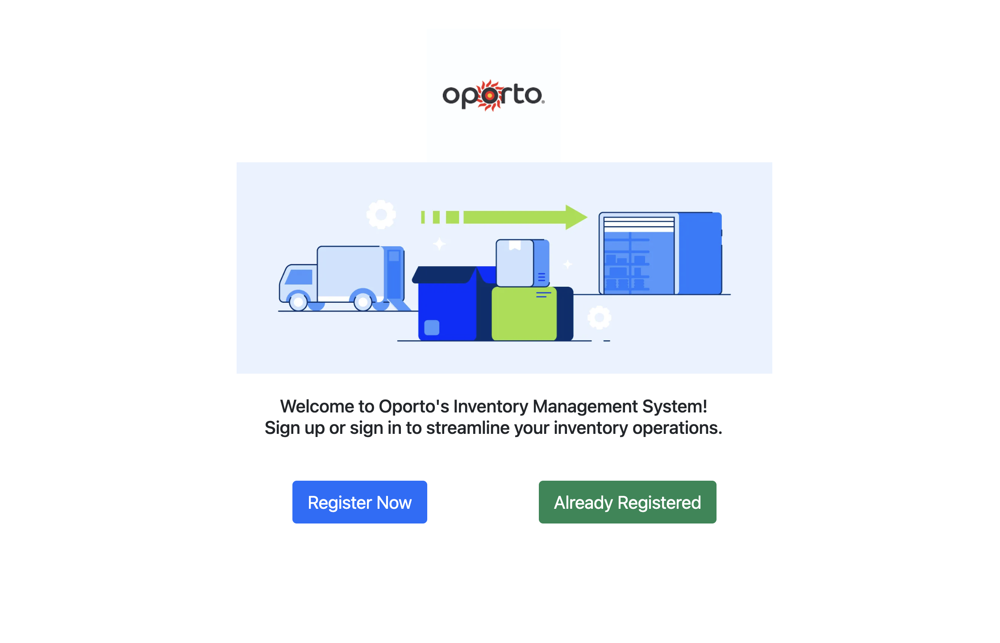

# Oporto's Inventory Management System

Oporto's Inventory Management System is a fictional system designed to manage inventory and facilitate various operations within the Oporto restaurant chain. This system streamlines inventory management processes and enhances the overall efficiency of operations within the Oporto restaurant chain.
It includes the following functionality: [Watch Demo](https://youtu.be/U0T9XXeQf9A)
- **Member Registration and Authentication:** Allows users to register as members of the system and authenticate themselves to access restricted features.
- **Menu Registration:** Enables the registration of items onto the menu list, including their categories, names, prices, quantity and other relevant details.
- **Menu Editing:** Provides functionality to edit existing menu items, allowing for updates to prices, quantity, or other attributes.
- **Menu Deletion:** Allows administrators to remove items from the menu when they are no longer available or relevant.
   

## Built with
- Backend: Java, Spring Boot 3.2.3, MySQL
- Frontend: HTML, Thymeleaf, Bootstrap CSS
- Tools and Platforms: Apache Tomcat 10.1.19, AWS EC2 (Ubuntu) & RDS (MySQL), IntelliJ IDEA
   

## Sequence Diagram (Member)
The sequence diagram illustrates the process of a member signing up or signing in to access the inventory management system.
   
.drawio.png)
   

## Sequence Diagram (Inventory management)
The sequence diagram illustrates the interactions related to menu management within the system, including menu registration, viewing menu lists, accessing menu details, editing menu details, and deleting menus.
   
.drawio.png)
   

## Development Log
[Please click here to see my development log](https://ringed-mist-28d.notion.site/9962c1a4fc6941169fef23fc271936b6)
   

